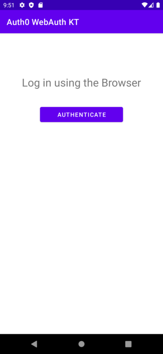
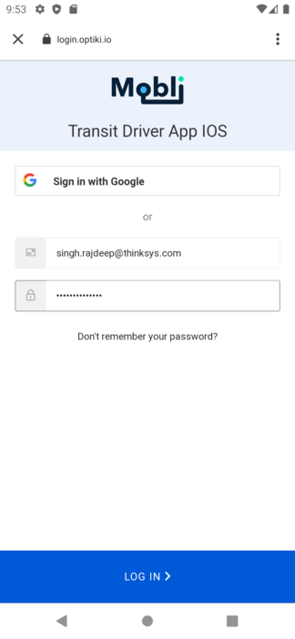
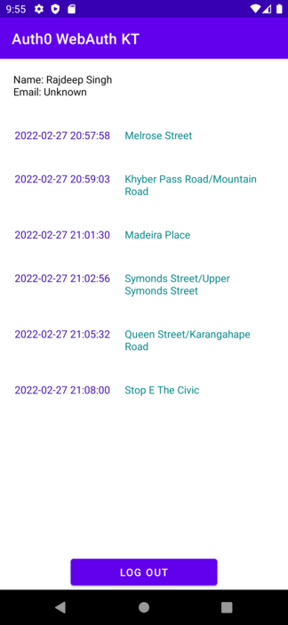

# Assessment for Mobli

This is a sample assessment done following the requirements described in .

# What's done

Implementing the MVI architecture which includes Reducers and Middlewares made me write significant
amount of boilerplate code. But once it's all set, the next features (like user profile screen) was
much pleasurable to work with.

I ended up with single activity application, where Jetpack Navigation library used for navigation between fragments.

Dagger Hilt is used as dependency injection component.
Retrofit2 and Gson libraries for network calls and parsing JSON. 

# What's missing

Couldn't get my head around to make AuthenticationAPIClient working with the initial authorization
instead of using webview authorization method. Otherwise I think it would be easier with the MVI
structure here, as the webview authorization strictly requires Activity to launch.

Unfortunately I couldn't use Jetpack Compose, as it would require for extra few days to learn it little deeper
from my existing knowledge about it.

Didn't write any Unit tests, as I ran out of time I dedicated for myself to accomplish this task.

# Overall

Thanks for the opportunity, it was fun

# Screenshots

  
